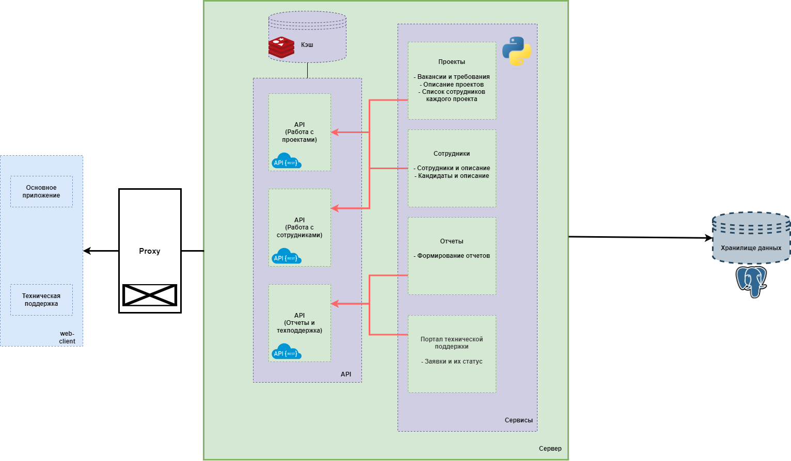
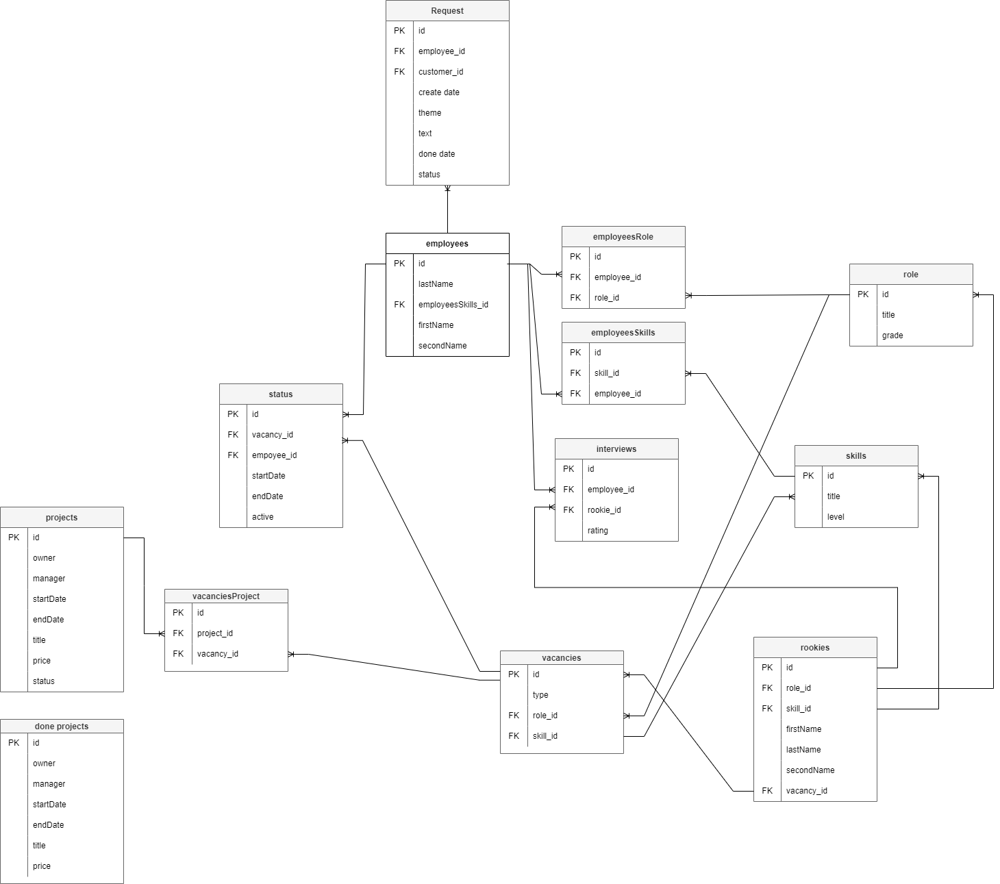

# ProjectIS
**Информационно-справочная система контроля проектов**

### Команда 2:

- Мерзляков Данила
- Саакян Давит
- Капралов Никита
- Телицын Егор
- Кучерявенко Никита
- Баранов Александр

Проект: https://github.com/DMerzlyakov/ProjectIS

## Описание приложения
Целью проекта автоматизации учета ресурсов является повышение эффективности работы в области управления ресурсами. Компания планирует заключить договор с Подрядчиком, с целью разработки автоматизированной системы, которая будет интегрирована во внутренний IT ландшафт (интеграция с кадровой, бухгалтерской и другими системами). Пользователями системы будут сотрудники HR департамента, а также менеджеры проектов (ПМ) технические и линейные руководители. Также предполагается, что все остальные сотрудники будут иметь ограниченный доступ к своему профилю.

Софт Технолоджи как Заказчик рассчитывает, что Подрядчик в рамках этого проекта создаст единую систему автоматизации управления ресурсами, которая удовлетворит предъявляемым требованиям и будет реализована максимально эффективно с точки зрения последующего владения системой.

Ключевые аспекты, которые следует учитывать при создании системы:

Снижение расходов – применение системы должно снизить стоимость процессов управления (например, за счет экономии времени, затрачиваемого сотрудниками на задачи управления ресурсами)
Автоматизация – максимальное исключение ручного труда в процессах управления ресурсами

Интеграция – система должны быть интегрирована с кадровой подсистемой (API) бухгалтерской системой (API) и SSO системой ([тут гипотетическая ссылка на документацию])

Простота и эргономичность – общие подходы к интерфейсу (look and feel) для всех пользователей, ориентированность на бизнес-процессы, простые и понятные интерфейсы и действия

Гибкость – способность системы развиваться при росте и расширении профиля деятельности компании

Производительность – способность системы обеспечивать приемлемый уровень работоспособности даже при росте нагрузки и (или) проблемах с оборудованием.

##Правила работы с системой контроля версий Git
Каждый участник из команды имеет свою ветку. Работа ведется именно в своих ветках. Всех своих соотрудников мы просим граммотно называть 
коммиты, так как потом мы обращаем внимание на то, как он пришел к такому или иному решению. После того, 
как все коммиты сделаны, необходимо загрузить из удаленного репозитория в локальный (git pull). 
Затем нужно загрузить изменения из локального репозитория в удаленный, чтобы локальные изменения 
стали доступными для коллег. Бывает так, что несколько сотрудников работали над одним и тем же
файлом, и при их синхронизации могут быть конфликты. Необходимо эффективно распределять работу между участниками разработки, 
чтобы таких общих файлов было как можно меньше. После выбора нужных файлов добавляет их в коммит 
и пушаем. В ветке master собираем весь рабочий код, после чего выпускаем релиз

## Схема архитектуры

## Модель данных

## Используемых технологии

- FastApi
- SqlAlchemy
- PostgeSQL

## Софт Технолоджи
Почтовый адрес: contact@softtel.ru

Телефон: +7(985)111-11-11

Город: Москва

## Roadmap

- [x] Добавить схему архитектуры проекта
- [x] Добавить модель данных
- [ ] Добавить используемые технологии
    - [x] частичо
    - [ ] полный список технологий
- [x] Отправить выполненное задание на почту

